# 🔍 VeritaAI - Système de Détection de Fausses et Vraies Nouvelles


## 📋 Table des matières

- [🎯 Aperçu du projet](#-aperçu-du-projet)
- [🚀 Fonctionnalités](#-fonctionnalités)
- [🏗️ Architecture](#-architecture)
- [🔧 Technologies utilisées](#-technologies-utilisées)
- [📊 Modèles et performances](#-modèles-et-performances)
- [🛠️ Installation](#-installation)
- [💻 Utilisation](#-utilisation)
- [📈 Suivi des expériences](#-suivi-des-expériences)
- [🎯 Résultats](#-résultats)
- [🚫 Limitations](#-limitations)
- [🔮 Perspectives](#-perspectives)
- [👥 Contribution](#-contribution)
- [📄 Licence](#-licence)

---

## 🎯 Aperçu du projet

La prolifération des fausses nouvelles ("fake news") représente une menace croissante pour l'information et la société. Ces contenus trompeurs peuvent manipuler l'opinion publique et semer la désinformation.

**Verita** est un projet conçu pour adresser ce problème en développant un système intelligent capable de détecter automatiquement les fausses nouvelles à l'aide d'algorithmes de machine learning. J'ai intégré MLflow pour un suivi, une comparaison et une gestion efficaces des expériences de modèles, assurant ainsi la reproductibilité et l'optimisation des performances.
---
### 🌟 Objectifs principaux

- Détecter automatiquement les fausses informations
- Fournir une interface intuitive pour l'analyse de textes
- Offrir un système de scoring de crédibilité
- Assurer une traçabilité complète des expériences ML

---

## 🚀 Mise en Place Technique

Cette section décrit les étapes clés de la mise en œuvre technique du projet.

### ✅ Fonctionnalités actuelles

- **Détection automatique** : Classification binaire (vrai/faux)
- **Interface utilisateur** : Application web Streamlit intuitive
- **Suivi MLflow** : Gestion complète des expériences
- **Modèles multiples** : Comparaison de 4 algorithmes différents
- **Prétraitement avancé** : Nettoyage et vectorisation TF-IDF

### 🔄 En développement

- API REST pour intégration externe
- Détection multilingue
- Analyse de sentiment
- Système d'explication des prédictions

---

## 🏗️ Architecture

```mermaid
graph TB
    A[NewsAPI] --> B[Script Python + Scheduler]
    B --> C[Base PostgreSQL Supabase]
    C --> D[Prétraitement & Vectorisation]
    D --> E[Modèles ML]
    E --> F[MLflow Tracking]
    F --> G[API Web FastAPI]
    G --> H[Interface Streamlit]
```



### 🔄 Flux de données

1. **Collecte** : Récupération d'articles via NewsAPI
2. **Stockage** : Sauvegarde structurée en base PostgreSQL
3. **Prétraitement** : Nettoyage et vectorisation TF-IDF
4. **Entraînement** : Modèles ML avec suivi MLflow
5. **Déploiement** : API web et interface utilisateur

---

## 🔧 Technologies utilisées

### 🐍 Backend & ML
- **Python 3.8+** : Langage principal
- **Scikit-learn** : Modèles de machine learning
- **MLflow** : Suivi et gestion des expériences
- **Pandas & NumPy** : Manipulation de données
- **NLTK/spaCy** : Traitement du langage naturel

### 🌐 Frontend & API
- **Streamlit** : Interface utilisateur
- **Flask/FastAPI** : API REST
- **HTML/CSS/JavaScript** : Interface web

### 🗄️ Base de données
- **PostgreSQL** : Stockage principal
- **SQLAlchemy** : ORM Python

---

## 📊 Modèles et performances

### 🤖 Modèles entraînés

| Modèle | Accuracy | F1 Score | Temps d'entraînement | Avantages |
|--------|----------|----------|---------------------|-----------|
| **Naive Bayes** | 93.7% | 93.7% | ⚡ Rapide | Simple, efficace sur texte |
| **Régression Logistique** | 98.7% | 98.7% | ⚡ Rapide | Robuste, interprétable |
| **SVM (RBF)** | 99.3% | 99.3% | 🐌 Lent | Puissant, relations non-linéaires |
| **LinearSVC** | **99.5%** | **99.5%** | ⚡ Rapide | **Meilleur équilibre** |

### 🏆 Modèle retenu : **LinearSVC**

**LinearSVC** a été sélectionné comme modèle de production pour :
- **Performance exceptionnelle** : 99.5% de précision
- **Rapidité** : Temps d'inférence optimal
- **Scalabilité** : Adapté aux grandes volumes de données
- **Robustesse** : Excellent sur vecteurs TF-IDF

---

## 🛠️ Installation

### 📋 Prérequis

- Python 3.8+
- pip ou conda
- PostgreSQL (optionnel)

### 🔧 Installation rapide

```bash
# Cloner le repository
git clone https://github.com/dona-eric/VeritaAI.git
cd VeritaAI

# Créer un environnement virtuel
python -m venv venv
source venv/bin/activate  # Linux/Mac
# ou
venv\Scripts\activate  # Windows

# Installer les dépendances
pip install -r requirements.txt

# Initialiser la base de données 
python3 connect_database.py
```

### 📦 Dépendances principales

```txt
streamlit>=1.28.0
scikit-learn>=1.3.0
mlflow>=2.7.0
pandas>=1.5.0
numpy>=1.24.0
nltk>=3.8
psycopg2-binary>=2.9.0
scheduler
sqlalchemy
```

---

## 💻 Utilisation

### 🚀 Lancement rapide

```bash
# Lancer l'interface Streamlit
streamlit run app.py

# Lancer MLflow UI (optionnel)
mlflow ui

# Entraîner les modèles(en cours de devéloppement)
python train_models.py
```

### 🎯 Utilisation de l'interface

1. **Sélection du rôle** : Choisir entre User, Admin, Super-admin
2. **Authentification** : Se connecter avec ses identifiants
3. **Analyse** : Saisir un texte pour analyse
4. **Résultats** : Consulter la prédiction et le score de confiance

### 📝 Exemple d'utilisation

```python
from veritaai import FakeNewsDetector

# Initialiser le détecteur
detector = FakeNewsDetector()

# Analyser un texte
text = "Votre article à analyser..."
result = detector.predict(text)

print(f"Prédiction: {result['prediction']}")
print(f"Confiance: {result['confidence']:.2%}")
```

---

## 📈 Suivi des expériences

### 🔍 MLflow Tracking

Toutes les expériences sont trackées avec MLflow :

```python
import mlflow

# Démarrer une expérience
with mlflow.start_run():
    # Enregistrer les métriques
    mlflow.log_metric("accuracy", 0.995)
    mlflow.log_metric("f1_score", 0.995)
    
    # Enregistrer le modèle
    mlflow.sklearn.log_model(model, "model")
```

### 📊 Interface MLflow

Accéder à l'interface de suivi :
```bash
mlflow ui
# Ouvrir http://127.0.0.1:5000
```


---

## 🎯 Résultats

### 📈 Métriques clés

- **Accuracy globale** : 99.5%
- **Précision** : 99.4%
- **Rappel** : 99.6%
- **F1-Score** : 99.5%

### 🎭 Matrice de confusion (LinearSVC)

```
             Prédiction
Réel      Faux   Vrai
Faux     4711     22
Vrai       19   4228
```

### 🔍 Analyse des erreurs

- **Faux positifs** : 22 articles (0.5%)
- **Faux négatifs** : 19 articles (0.4%)
- **Principaux défis** : Articles satiriques, opinions subjectives

---

## 🚫 Limitations

### ⚠️ Limitations actuelles

- **Langue** : Uniquement en anglais pour le moment
- **Contexte** : Classification binaire simplifiée
- **Données** : Dépendant de la qualité du dataset d'entraînement
- **Biais** : Possible biais dans les sources d'entraînement

### 🔄 Améliorations prévues

- Support multilingue
- Classification à plusieurs niveaux
- Détection de biais
- Amélioration continue du dataset

---

## 🔮 Perspectives

### 🚀 Roadmap

#### Phase 1 (En cours)
- [ ] API REST complète
- [ ] Système d'authentification avancé
- [ ] Interface d'administration

#### Phase 2 (Prochaine)
- [ ] Support multilingue
- [ ] Analyse de sentiment
- [ ] Détection de sources

#### Phase 3 (Future)
- [ ] IA explicable (SHAP, LIME)
- [ ] Détection en temps réel
- [ ] Intégration réseaux sociaux

---

## 👥 Contribution

### 🤝 Comment contribuer

1. **Fork** le projet
2. **Créer** une branche feature (`git checkout -b feature/FeatureVeritaAI`)
3. **Commit** vos changements (`git commit -m 'Add FeatureVeritaAI'`)
4. **Push** vers la branche (`git push origin feature/FutureVeritaAi`)
5. **Ouvrir** une Pull Request

### 📝 Guidelines

- Respecter le style de code (PEP 8)
- Ajouter des tests pour les nouvelles fonctionnalités
- Documenter les changements

---

## 📄 Licence

Ce projet est sous licence MIT. Voir le fichier [LICENSE](LICENSE) pour plus de détails.

---

## 👨‍💻 Auteur

**KOULODJI Dona Eric**
- 🐙 GitHub: [@dona-eric](https://github.com/dona-eric)
- 💼 LinkedIn: [dona-erick](https://linkedin.com/in/dona-erick)
- 📧 Email: donaerickoulodji@gmail.com

---

## 🙏 Remerciements

- **Équipe MLflow** pour l'excellent framework de tracking
- **Communauté Streamlit** pour l'interface intuitive
- **Contributeurs open source** pour les outils utilisés

---

## 📞 Support

Si vous avez des questions ou des problèmes :

1. 📚 Consultez la [documentation](docs/)
2. 🐛 Ouvrez une [issue](https://github.com/votre-username/veritaai/issues)
3. 💬 Rejoignez nos [discussions](https://github.com/votre-username/veritaai/discussions)

---

<div align="center">
  <p>
    <strong>⭐ N'hésitez pas à mettre une étoile si ce projet vous a aidé ! ⭐</strong>
  </p>
  <p>
    Made with ❤️ by <a href="https://github.com/dona-eric">KOULODJI Dona Eric</a>
  </p>
</div>